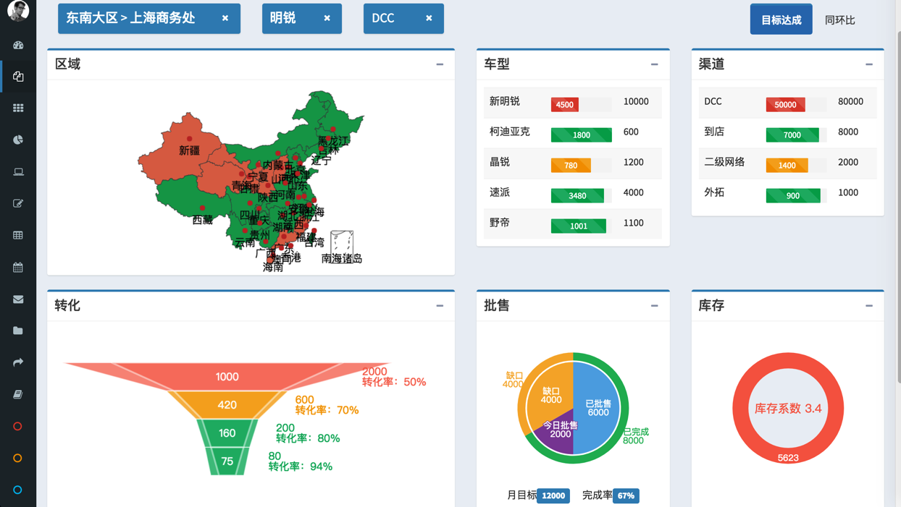
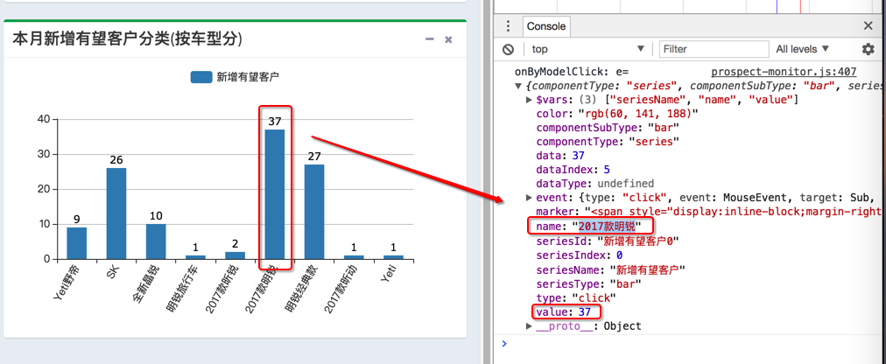
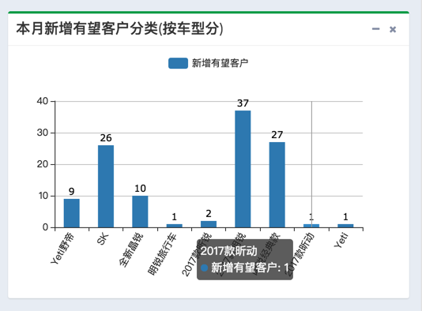
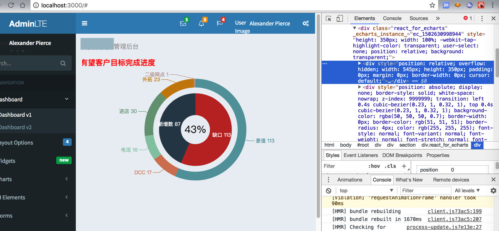
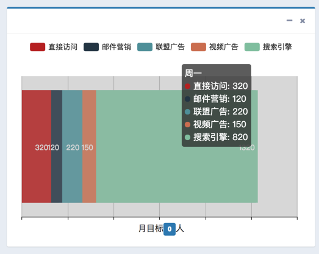
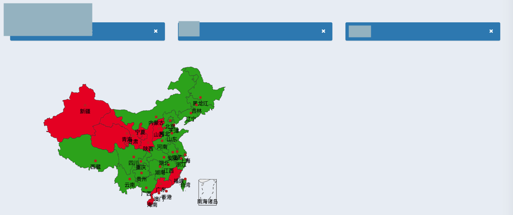
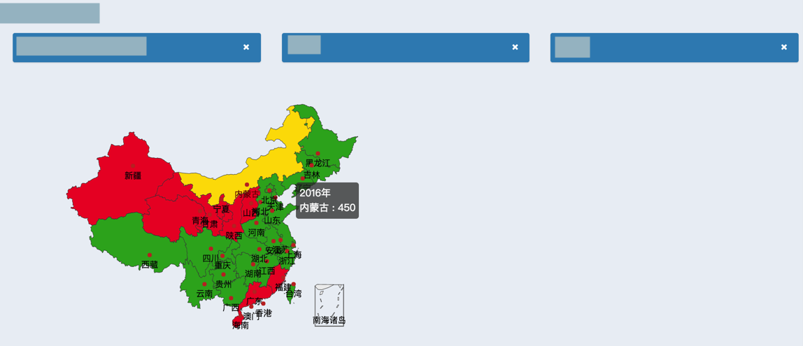
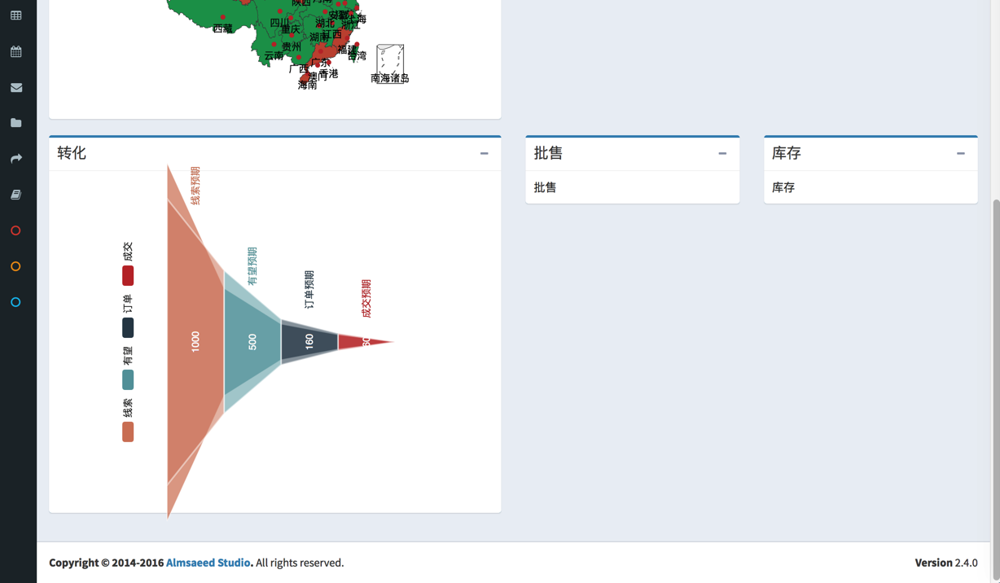

# 示例

## ReactJS-AdminLTE

## 多个图表

某个报表：

代码：

```html
<!DOCTYPE html>
<html>

<head>
    <meta charset="utf-8">
    <meta http-equiv="X-UA-Compatible" content="IE=edge">
    <title>xxx报表</title>
    <!– Tell the browser to be responsive to screen width –>
        <meta content="width=device-width, initial-scale=1, maximum-scale=1, user-scalable=no" name="viewport">
        <!– Bootstrap 3.3.7 –>
            <link rel="stylesheet" href="bower_components/bootstrap/dist/css/bootstrap.min.css">
            <!– Font Awesome –>
                <link rel="stylesheet" href="bower_components/font-awesome/css/font-awesome.min.css">
                <!– Ionicons –>
                    <link rel="stylesheet" href="bower_components/Ionicons/css/ionicons.min.css">
                    <!– Theme style –>
                        <link rel="stylesheet" href="dist/css/AdminLTE.min.css">
                        <!– AdminLTE Skins. Choose a skin from the css/skins folder instead of downloading all of them
                            to reduce the load. –>
                            <link rel="stylesheet" href="dist/css/skins/_all-skins.min.css">
                            <!– HTML5 Shim and Respond.js IE8 support of HTML5 elements and media queries –>
                                <!– WARNING: Respond.js doesn't work if you view the page via file:// –>
                                    <!–[if lt IE 9]>
                                        <script src="https://oss.maxcdn.com/html5shiv/3.7.3/html5shiv.min.js"></script>;
                                        <script src="https://oss.maxcdn.com/respond/1.4.2/respond.min.js"></script>;
                                        <![endif]–>
  <!– Google Font –>
  <link rel="stylesheet" href="https://fonts.googleapis.com/css?family=Source+Sans+Pro:300,400,600,700,300italic,400italic,600italic">;
  <style type="text/css">
    .nav-pills > li > a {
      border-radius: 4px 4px 4px 4px;
    }
  </style>
</head>
<!– ADD THE CLASS sidebar-collapse TO HIDE THE SIDEBAR PRIOR TO LOADING THE SITE –>
<body class="hold-transition skin-blue sidebar-collapse sidebar-mini">
<!– Site wrapper –>
<div class="wrapper">
。。。
  <!– Content Wrapper. Contains page content –>
  <div class="content-wrapper">
    <!– Content Header (Page header) –>
    <!– <section class="content-header">
      <h1>
        xxx报表
      </h1>
    </section> –>
    <!– Main content –>
    <section class="content">
      <div class="row">
        <div class="col-md-6">
          <!– <div class="col-md-4 col-sm-4 col-xs-4" style="width: 260px;"> –>
          <div class="col-md-6">
            <div class="box box-solid box-primary">
              <div class="box-header">
                <h5 class="box-title">东南大区 > 上海商务处</h5>
      
                <div class="box-tools pull-right">
                  <button type="button" class="btn btn-box-tool" data-widget="remove" data-toggle="tooltip" title="Remove">
                    <i class="fa fa-times"></i></button>
                </div>
              </div>
            </div>
          </div>
    
          <!– <div class="col-md-4 col-sm-4 col-xs-4" style="width: 120px;"> –>
          <div class="col-md-3">
            <div class="box box-solid box-primary">
              <div class="box-header">
                <h5 class="box-title">明锐</h5>
      
                <div class="box-tools pull-right">
                  <button type="button" class="btn btn-box-tool" data-widget="remove" data-toggle="tooltip" title="Remove">
                    <i class="fa fa-times"></i></button>
                </div>
              </div>
            </div>
          </div>
          <!– <div class="col-md-4 col-sm-4 col-xs-4" style="width: 120px;"> –>
          <div class="col-md-3">
            <div class="box box-solid box-primary">
              <div class="box-header">
                <h5 class="box-title">DCC</h5>
      
                <div class="box-tools pull-right">
                  <button type="button" class="btn btn-box-tool" data-widget="remove" data-toggle="tooltip" title="Remove">
                    <i class="fa fa-times"></i></button>
                </div>
              </div>
            </div>
          </div>
      </div>
      
      <div class="col-md-3">
        <div>
        </div>
      </div>
      <!– <div class="col-md-4">
          <div class="col-md-6">
            <button type="button" class="btn btn-block btn-info">目标达成</button>
          </div>
          <div class="col-md-6">
            <button type="button" class="btn btn-block btn-info">同环比</button>
          </div>
      </div> –>
      <div class="col-md-3">
        <div class="col-md-3">
          <div>
          </div>
        </div>
        
        <div class="col-md-9">
          <!– <div class="nav-tabs-custom">
            <ul class="nav nav-tabs">
              <li class="active"><a href="#tab_1" data-toggle="tab" aria-expanded="true">目标达成</a></li>
              <li class=""><a href="#tab_2" data-toggle="tab" aria-expanded="true">同环比</a></li>
            </ul>
          </div> –>
          <ul class="nav nav-pills">
            <li class="active">
              <a href="#target_complete" data-toggle="tab">目标达成</a>
            </li>
            <li>
              <a href="#yoy" data-toggle="tab">同环比</a>
            </li>
          </ul>
        </div>
      </div>
      </div>
      <div class="row">
        <div class="col-md-6">
          <div class="box box-primary">
            <div class="box-header with-border">
              <h3 class="box-title">区域</h3>
    
              <div class="box-tools pull-right">
                <button type="button" class="btn btn-box-tool" data-widget="collapse" data-toggle="tooltip" title="Collapse">
                <i class="fa fa-minus"></i></button>
              </div>
            </div>
            <div class="box-body">
              <div id="echart_map" style="width: 100%; height:250px;transform: scale(1.2, 1.2);" >
              </div>
            </div>
          </div>
        </div>
        <div class="col-md-3">
          <div class="box box-primary">
            <div class="box-header with-border">
              <h3 class="box-title">车型</h3>
    
              <div class="box-tools pull-right">
                <button type="button" class="btn btn-box-tool" data-widget="collapse" data-toggle="tooltip" title="Collapse">
                <i class="fa fa-minus"></i></button>
              </div>
            </div>
            <div class="box-body">
              <div class="box-body no-padding">
                <table class="table table-striped">
                  <tr>
                    <td>新明锐</td>
                    <td style="width: 100px">
                      <div class="progress progress-striped active">
                        <div class="progress-bar progress-bar-danger" style="width: 45%;">4500</div>
                      </div>
                    </td>
                    <td>10000</td>
                  </tr>
                  <tr>
                    <td>柯迪亚克</td>
                    <td>
                      <div class="progress progress-striped active">
                        <div class="progress-bar progress-bar-success" style="width: 100%;">1800</div>
                      </div>
                    </td>
                    <td>600</td>
                  </tr>
                  <tr>
                    <td>晶锐</td>
                    <td>
                      <div class="progress progress-striped active">
                        <div class="progress-bar progress-bar-yellow" style="width: 65%">780</div>
                      </div>
                    </td>
                    <td>1200</td>
                  </tr>
                  <tr>
                    <td>速派</td>
                    <td>
                      <div class="progress progress-striped active">
                        <div class="progress-bar progress-bar-success" style="width: 87%">3480</div>
                      </div>
                    </td>
                    <td>4000</td>
                  </tr>
                  <tr>
                    <td>野帝</td>
                    <td>
                      <div class="progress progress-striped active">
                        <div class="progress-bar progress-bar-success" style="width: 91%">1001</div>
                      </div>
                    </td>
                    <td>1100</td>
                  </tr>
                </table>
              </div>
            </div>
          </div>
        </div>
        
        <div class="col-md-3">
            <div class="box box-primary">
              <div class="box-header with-border">
                <h3 class="box-title">渠道</h3>
      
                <div class="box-tools pull-right">
                  <button type="button" class="btn btn-box-tool" data-widget="collapse" data-toggle="tooltip" title="Collapse">
                  <i class="fa fa-minus"></i></button>
                </div>
              </div>
              <div class="box-body">
                <div class="box-body no-padding">
                  <table class="table table-striped">
                    <tr>
                      <td>DCC</td>
                      <td style="width: 100px">
                        <div class="progress progress-striped active">
                          <div class="progress-bar progress-bar-danger" style="width: 65%;">50000</div>
                        </div>
                      </td>
                      <!– <td><span class="badge bg-red">80000</span></td> –>
                      <td>80000</td>
                    </tr>
                    <tr>
                      <td>到店</td>
                      <td>
                        <div class="progress progress-striped active">
                          <div class="progress-bar progress-bar-success" style="width: 87%;">7000</div>
                        </div>
                      </td>
                      <!– <td><span class="badge bg-green">8000</span></td> –>
                      <td>8000</td>
                    </tr>
                    <tr>
                      <td>二级网络</td>
                      <td>
                        <div class="progress progress-striped active">
                          <div class="progress-bar progress-bar-yellow" style="width: 70%">1400</div>
                        </div>
                      </td>
                      <!– <td><span class="badge bg-yellow">2000</span></td> –>
                      <td>2000</td>
                    </tr>
                    <tr>
                      <td>外拓</td>
                      <td>
                        <div class="progress progress-striped active">
                          <div class="progress-bar progress-bar-success" style="width: 90%">900</div>
                        </div>
                      </td>
                      <!– <td><span class="badge bg-green">1000</span></td> –>
                      <td>1000</td>
                    </tr>
                  </table>
                </div>
              </div>
            </div>
          </div>
      </div>
      
      <div class="row">
        <div class="col-md-6">
          <div class="box box-primary">
            <div class="box-header with-border">
              <h3 class="box-title">转化</h3>
    
              <div class="box-tools pull-right">
                <button type="button" class="btn btn-box-tool" data-widget="collapse" data-toggle="tooltip" title="Collapse">
                <i class="fa fa-minus"></i></button>
              </div>
            </div>
            <div class="box-body">
              <!– <div id="echart_convertion" style="width: 100%; height:250px; transform: rotate(270deg) scale(0.6, 1.6);" > –>
              <div id="echart_convertion" style="width: 100%; height:250px; transform: scale(1.2, 1.2);" >
              <!– <div id="echart_convertion" style="width: 100%; height:250px;" > –>
              </div>
            </div>
          </div>
        </div>
        <div class="col-md-3">
          <div class="box box-primary">
            <div class="box-header with-border">
              <h3 class="box-title">批售</h3>
    
              <div class="box-tools pull-right">
                <button type="button" class="btn btn-box-tool" data-widget="collapse" data-toggle="tooltip" title="Collapse">
                <i class="fa fa-minus"></i></button>
              </div>
            </div>
            <div class="box-body">
              <div id="echart_wholesales" style="height:220px;" ></div>
              <div style="text-align:center;">
                  <p>
                    月目标<span class="label label-primary">12000</span>
                    &nbsp;&nbsp;&nbsp;&nbsp;
                    完成率<span class="label label-primary">67%</span>
                  </p>
              </div>
            </div>
          </div>
        </div>
        
        <div class="col-md-3">
          <div class="box box-primary">
            <div class="box-header with-border">
              <h3 class="box-title">库存</h3>
    
              <div class="box-tools pull-right">
                <button type="button" class="btn btn-box-tool" data-widget="collapse" data-toggle="tooltip" title="Collapse">
                <i class="fa fa-minus"></i></button>
              </div>
            </div>
            <div class="box-body">
              <div id="echart_inventory" style="height:220px;" ></div>
              <div style="text-align:center;">
                  <p>&nbsp;&nbsp;&nbsp;&nbsp;</p>
              </div>
            </div>
          </div>
        </div>
      </div>
    </section>
    <!– /.content –>
  </div>
  <!– /.content-wrapper –>
<!– Add the sidebar's background. This div must be placed
       immediately after the control sidebar –>
  <div class="control-sidebar-bg"></div>
</div>
<!– ./wrapper –>
<!– ECharts –>
<script src="dist/lib/echarts/echarts.js"></script>
<script src="dist/lib/echarts/map/china.js"></script>
<!– <script src="dist/lib/echarts/china.js"></script> –>
<!– jQuery 3 –>
<script src="bower_components/jquery/dist/jquery.min.js"></script>
<!– Bootstrap 3.3.7 –>
<script src="bower_components/bootstrap/dist/js/bootstrap.min.js"></script>
<!– SlimScroll –>
<script src="bower_components/jquery-slimscroll/jquery.slimscroll.min.js"></script>
<!– FastClick –>
<script src="bower_components/fastclick/lib/fastclick.js"></script>
<!– AdminLTE App –>
<script src="dist/js/adminlte.min.js"></script>
<!– AdminLTE for demo purposes –>
<script src="dist/js/demo.js"></script>
<script type="text/javascript">

    const ValueColor = {
        RED: '#F56954′, //rgb(245, 105,  84)',
        GRAY: '#D2D654′, //rgb(210, 214,  222)',
        GREEN: '#00A65A', //rgb(0,   166,  90)',
        YELLOW: '#F39C12′, //rgb(243, 156,  18)',
        LIGHT_BLUE: '#00C0EF', //'rgb(0,   192,  239)',
        DARK_BLUE: '#3C8DBC', //'rgb(60,  141,  188)',
        WHITE: '#FFFFFF', //'rgb(255, 255,  255)',
    };
</script>
<script type="text/javascript">
    var mapEcharts = echarts.init(document.getElementById('echart_map'));
    option = {
        title: {
            text: ",
        subtext: ",
        left: 'center'
        },
        tooltip: {
            trigger: 'item'
        },
        legend: {
            orient: 'vertical',
            left: 'left',
            // data:['2017年']
        },
        visualMap: {
            show: false,
            min: 0,
            max: 500,
            // splitNumber: 250,
            // splitNumber: 100,
            // max: 450,
            left: 'left',
            top: 'bottom',
            text: ['高', '低'],           // 文本，默认为数值文本
            calculable: false,
            // calculable: true,
            inRange: {
                //color: [ '#e0f3f8', '#ffffbf', '#fee090', '#fdae61', '#f46d43', '#d73027', '#a50026']
                // color: [ '#FF0033', '#22BF2E']
                //AdminLTE: red, green
                // color: [ '#DD4B39', '#00A65A']
                color: [ValueColor.RED, ValueColor.GREEN],
                //other: red, green
                // color: [ '#FF4500', '#7FFF00'],
                // opacity: 1.0
            }
        },
        // toolbox: {
        //     show: true,
        //     orient: 'vertical',
        //     left: 'right',
        //     top: 'center',
        //     feature: {
        //         dataView: {readOnly: false},
        //         restore: {},
        //         saveAsImage: {}
        //     }
        // },
        // geo: {
        //   show: true,
        //   map: 'china',
        //   regions: [{
        //       name: '广东',
        //       itemStyle: {
        //           normal: {
        //               areaColor: ValueColor.YELLOW,
        //               // color: ValueColor.YELLOW
        //           }
        //       }
        //   }],
        //   itemStyle: {
        //       normal: {
        //           areaColor: ValueColor.DARK_BLUE,
        //           // borderColor: '#111'
        //       },
        //       emphasis: {
        //         areaColor: ValueColor.DARK_BLUE,
        //       }
        //   }
        // },
        series: [
            {
                name: '2016年',
                type: 'map',
                // type: 'scatter',
                // coordinateSystem: 'geo',
                // mapType: 'china',
                map: 'china',
                roam: false,
                label: {
                    normal: {
                        show: true
                    },
                    emphasis: {
                        show: true
                    }
                },
                data: [
                    // data: convertData([
                    //大西北区
                    {
                        name: '甘肃',
                        value: 50,
                    },
                    { name: '青海', value: 50 },
                    {
                        name: '新疆',
                        value: 50,
                        // itemStyle: {
                        //   normal: {
                        //     areaColor: ValueColor.YELLOW,
                        //     color: ValueColor.YELLOW,
                        //   }
                        // }
                    },
                    { name: '宁夏', value: 50 },
                    { name: '陕西', value: 50 },
                    { name: '山西', value: 50 },
                    //大中南区
                    { name: '湖南', value: 450 },
                    { name: '江西', value: 450 },
                    { name: '湖北', value: 450 },
                    //大华东区
                    { name: '江苏', value: 450 },
                    { name: '安徽', value: 450 },
                    //大华南区
                    { name: '广东', value: 50 },
                    { name: '海南', value: 50 },
                    { name: '福建', value: 50 },
                    //大华北区
                    { name: '黑龙江', value: 450 },
                    { name: '吉林', value: 450 },
                    { name: '辽宁', value: 450 },
                    { name: '河北', value: 450 },
                    { name: '天津', value: 450 },
                    { name: '北京', value: 450 },
                    { name: '内蒙古', value: 450 },
                    //大华中区
                    { name: '河南', value: 450 },
                    { name: '山东', value: 450 },
                    //大东南区
                    { name: '浙江', value: 450 },
                    { name: '上海', value: 450 },
                    //大西南区
                    { name: '重庆', value: 450 },
                    { name: '四川', value: 450 },
                    { name: '西藏', value: 450 },
                    { name: '云南', value: 450 },
                    { name: '广西', value: 450 },
                    { name: '贵州', value: 450 },
                    { name: '台湾', value: 450 },
                    { name: '香港', value: 450 },
                    { name: '澳门', value: 450 }
                ]
                // ])
            },
        ]
    };
    mapEcharts.setOption(option);
</script>
<script type="text/javascript">
    var convertionEcharts = echarts.init(document.getElementById('echart_convertion'));
    option = {
        title: {
            text: ",
        subtext: "
        },
        tooltip: {
            trigger: 'item',
            // formatter: "{a} <br/>{b} : {c}%"
            formatter: "{a} <br/>{b} : {c}"
        },
        // toolbox: {
        //     feature: {
        //         dataView: {readOnly: false},
        //         restore: {},
        //         saveAsImage: {}
        //     }
        // },
        // legend: {
        //     data: ['线索','有望','订单','成交']
        // },
        series: [
            {
                name: '目标',
                type: 'funnel',
                // left: '10%',
                // width: '80%',
                left: '10%',
                width: '70%',
                minSize: '10%',
                maxSize: '100%',
                label: {
                    normal: {
                        formatter: '{c}'
                    },
                    emphasis: {
                        position: 'inside',
                        // formatter: '{b}预期: {c}%'
                        formatter: '{b}目标: {c}'
                    }
                },
                labelLine: {
                    normal: {
                        show: false
                    }
                },
                itemStyle: {
                    normal: {
                        opacity: 0.7
                    }
                },
                data: [
                    {
                        value: 80,
                        name: '成交',
                        itemStyle: {
                            normal: {
                                color: ValueColor.GREEN
                            }
                        },
                        label: {
                            normal: {
                                formatter: '{c}\n转化率：94%',
                                textStyle: {
                                    color: ValueColor.GREEN
                                }
                            }
                        },
                    },
                    {
                        value: 200,
                        name: '订单',
                        itemStyle: {
                            normal: {
                                color: ValueColor.GREEN
                            }
                        },
                        label: {
                            normal: {
                                formatter: '{c}\n转化率：80%',
                                textStyle: {
                                    color: ValueColor.GREEN
                                }
                            }
                        },
                    },
                    {
                        value: 600,
                        name: '有望',
                        itemStyle: {
                            normal: {
                                color: ValueColor.YELLOW
                            }
                        },
                        label: {
                            normal: {
                                formatter: '{c}\n转化率：70%',
                                textStyle: {
                                    color: ValueColor.YELLOW
                                }
                            }
                        },
                    },
                    {
                        value: 2000,
                        name: '线索',
                        itemStyle: {
                            normal: {
                                color: ValueColor.RED
                            }
                        },
                        label: {
                            normal: {
                                formatter: '{c}\n转化率：50%',
                                textStyle: {
                                    color: ValueColor.RED
                                }
                            }
                        },
                    }
                ]
            },
            {
                name: '实际',
                type: 'funnel',
                // left: '10%',
                // width: '80%',
                // maxSize: '80%',
                left: '10%',
                width: '70%',
                minSize: '5%',
                maxSize: '70%',
                label: {
                    normal: {
                        position: 'inside',
                        // position: 'outside',
                        // formatter: '{c}%',
                        formatter: '{c}',
                        textStyle: {
                            color: '#fff'
                        }
                    },
                    emphasis: {
                        position: 'inside',
                        // formatter: '{b}实际: {c}%'
                        formatter: '{b}实际: {c}'
                    }
                },
                itemStyle: {
                    normal: {
                        opacity: 0.5,
                        borderColor: '#fff',
                        borderWidth: 2
                    }
                },
                data: [
                    {
                        value: 75,
                        name: '成交',
                        itemStyle: {
                            normal: {
                                color: ValueColor.GREEN
                            }
                        },
                        // label: {
                        //   normal: {
                        //     position: 'outside'
                        //   }
                        // }
                    },
                    {
                        value: 160,
                        name: '订单',
                        itemStyle: {
                            normal: {
                                color: ValueColor.GREEN
                            }
                        }
                    },
                    {
                        value: 420,
                        name: '有望',
                        itemStyle: {
                            normal: {
                                color: ValueColor.YELLOW
                            }
                        }
                    },
                    {
                        value: 1000,
                        name: '线索',
                        itemStyle: {
                            normal: {
                                color: ValueColor.RED
                            }
                        }
                    }
                ]
            }
        ]
    };
    convertionEcharts.setOption(option);
</script>
<script type="text/javascript">
    var wholesalesEcharts = echarts.init(document.getElementById('echart_wholesales'));
    option = {
        title: {
            text: "",
            subtext: "",
            left: "center",
            textStyle: {
                color: "#fff",
                fontSize: 18
            },
        },
        backgroundColor: '#ffffff',
        tooltip: {
            trigger: 'item',
            formatter: "{a} <br/>{b}:({d}%)"
        },
        series: [{
            name: '批售详细数据',
            type: 'pie',
            // radius: ['0%', '60%'],
            radius: ['0%', '58%'],
            // color: ['#ec5d51', '#59abe1', '#f4cf42', '#3dc6a8'],
            color: ['#5DADE2', '#884EA0', '#F5B041',],
            // color: ['#FDFEFE', '#28B463'],
            // color: ['#a0dca0', '#60bbb6', '#f78db3'],
            label: {
                normal: {
                    position: 'inner',
                    formatter: '{b}\n{c}'
                }
            },
            data: [
                {
                    value: 6000,
                    name: '已批售'
                },
                {
                    value: 2000,
                    name: '今日批售'
                },
                {
                    value: 4000,
                    name: '缺口'
                },
            ]
        }, {
            name: '批售总体数据',
            type: 'pie',
            radius: ['60%', '70%'],
            labelLine: {
                normal: {
                    length: 1,
                    length2: 1
                }
            },
            //color: ['#a0dca0', '#60bbb6', '#f78db3', '#feadac', '#fae395′,'#91d4e5′,'#8eb3e8'],
            color: ['#28B463', '#FDFEFE'],
            label: {
                normal: {
                    formatter: '{b}\n{c}'
                }
            },
            data: [
                {
                    value: 8000,
                    name: '已完成'
                },
                {
                    value: 4000,
                    name: '缺口'
                }
            ]
        }]
    };
    wholesalesEcharts.setOption(option);
</script>
<script type="text/javascript">
    var inventoryEcharts = echarts.init(document.getElementById('echart_inventory'));
    option = {
        title: {
            text: "",
            subtext: "",
            left: "center",
            textStyle: {
                color: "#fff",
                fontSize: 18
            },
        },
        backgroundColor: '#ffffff',
        tooltip: {
            trigger: 'item',
            formatter: "{a} <br/>{b}:({d}%)"
        },
        series: [
            // {
            //   name: '总部库存',
            //   type: 'pie',
            //   // radius: ['20%', '40%'],
            //   radius: ['20%', '45%'],
            //   // color: [ ValueColor.RED ],
            //   label: {
            //       normal: {
            //           position: 'inner',
            //           formatter: '{b}: {c}\n库存当量: 0.34'
            //       }
            //   },
            //   data: [
            //     {
            //         value: 1438,
            //         name: '总部',
            //         normal: {
            //           color: ValueColor.RED
            //         }
            //     }
            //   ]
            // },
            // {
            //   name: '经销商库存',
            //   type: 'pie',
            //   // radius: ['40%', '60%'],
            //   radius: ['45%', '70%'],
            //   labelLine : {
            //     normal : {
            //       length : 1,
            //       length2 : 1
            //     }
            //   },
            //   color: [ ValueColor.GREEN ],
            //   label: {
            //       normal: {
            //           formatter: '{b}: {c}\n库存当量: 2.31'
            //       }
            //   },
            //   data: [
            //     {
            //         value: 563,
            //         name: '经销商',
            //         // normal: {
            //         //   color: ValueColor.GREEN
            //         // }
            //     }
            //   ]
            // }
            {
                name: '库存系数',
                type: 'pie',
                selectedMode: 'single',
                radius: ['0%', '50%'],
                label: {
                    normal: {
                        position: 'center',
                        formatter: '{a} {c}',
                        textStyle: {
                            // color: '#000000',
                            color: ValueColor.RED,
                            fontSize: 16
                        }
                    },
                    emphasis: {
                        position: 'center',
                        formatter: '{a} {c}',
                        textStyle: {
                            // color: '#000000',
                            color: ValueColor.RED,
                            fontSize: 16
                        }
                    }
                },
                itemStyle: {
                    normal: {
                        color: '#ECF0F5'
                    }
                },
                data: [
                    {
                        value: '3.4',
                        name: '总部',
                        tooltip: {
                            trigger: 'item',
                            formatter: '{a} <br/>{c} ({d}%)'
                        },
                    }
                ]
            },
            {
                name: '库存数量',
                type: 'pie',
                radius: ['50%', '70%'],
                labelLine: {
                    normal: {
                        length: 1,
                        length2: 1
                    }
                },
                color: [ValueColor.RED],
                label: {
                    normal: {
                        position: 'inner',
                        formatter: '{c}'
                    }
                },
                data: [
                    {
                        value: 5623,
                        name: '经销商',
                        // normal: {
                        //   color: ValueColor.GREEN
                        // }
                    }
                ]
            }
        ]
    };
    inventoryEcharts.setOption(option);
</script>
</body>
</html>
```

效果：



### 柱状图

代码：

```js
let curEchartsOption = {
  color: ['#3398DB'],
  tooltip : {
    trigger: 'axis',
    axisPointer : {            // 坐标轴指示器，坐标轴触发有效
      type : 'shadow'        // 默认为直线，可选为：'line' | 'shadow'
    }
  },
  grid: {
    left: '3%',
    right: '4%',
    bottom: '3%',
    containLabel: true
  },
  xAxis : [
    {
      type : 'category',
      data : ['Yeti野帝', 'SK', '全新晶锐', '明锐旅行车', '2017款昕锐', '2017款明锐', '明锐经典款', '2017款昕动', 'Yeti'],
      axisTick: {
        alignWithLabel: true
      }
    }
  ],
  yAxis : [
    {
      type : 'value'
    }
  ],
  series : [
    {
      name:'直接访问',
      type:'bar',
      barWidth: '60%',
      data:[9, 26, 10, 1, 2, 37, 27, 1, 1]
    }
  ]
};
```

效果：




#### 添加点击事件

代码：

```js
import ReactEcharts from 'echarts-for-react';
  onByModelClick(e){
    console.log('onByModelClick: e=', e);
  }
  onClickByModelEvents = {
    'click': this.onByModelClick
  }
  render() {
    console.log(`ProcessMonitor render`);
    return (
。。。
                  <div className="chart">
                    <ReactEcharts
                      option={this.state.newAddByModelDict.echartsOption}
                      onEvents={this.onClickByModelEvents}
                    />
                  </div>
```

#### 显示x轴的标签

代码：

* 核心代码

```js
axisLabel: {
  interval: 0,
  rotate: 60
},
```

* 完整代码

```js
    var curEchartsOption = {
            // title : {
          //       text:'本月新增有望客户分类(按车型分)',  
          //       textStyle :{
          //           fontWeight:'normal',
          //           fontSize:'14'
          //       },
      //       // subtext:datName,
      //       subtext: 'DCC',
          //       subtextStyle:{
          //           fontWeight:'normal',
          //           fontSize:'14',
          //           color:'red'
          //       },
          //       top:10,
          //       left: 10
          //   },
            tooltip: {
                trigger: 'axis'
            },
            toolbox: {
                feature: {
                    dataView: {show: false, readOnly: true},
                    magicType: {show: false, type: ['bar']},
                    restore: {show: false},
                    saveAsImage: {show: false}
                }
            },
            legend: {
                // left: '75%',
          // top:33,
          top: 0,
          data:['新增有望客户']
            },
            grid:{
                bottom:80
            },
            xAxis: [
                {
                    type: 'category',
                    axisLabel: {
                        interval:0,
                        rotate:60
                    },
                // data:hopeNameArr
                data: ['Yeti野帝', 'SK', '全新晶锐', '明锐旅行车', '2017款昕锐', '2017款明锐', '明锐经典款', '2017款昕动', 'Yeti'],
                }
            ],
            yAxis: [
                {
                    type: 'value',
                    min: 0,
                    //max: 200,
                   // interval: 30,
                    axisLabel: {
                        formatter: '{value}'
                    }
                }
            ],
            series: [
                {
                    name:'新增有望客户',
                    type:'bar',
                    barWidth : 20,//柱图宽度
                    label: {
                        normal: {
                            show: true,
                            color:'red',
                            position: 'top',
                            textStyle: {
                                color: 'black',
                                fontFamily: 'verdana',
                                fontSize: 12,
                                fontStyle: 'normal'
                            }
                        }
                    },
                    itemStyle: {
                  // normal:{color:'#C0DDAD' }
                  // normal:{color:'#3398DB' }
                  normal:{color: ValueColor.DARK_BLUE }
                    },
                // data:hopeNameArrNum
                data: [9, 26, 10, 1, 2, 37, 27, 1, 1]
                }
            ]
        };
```

效果：



### 多层饼图

* 多层饼图==嵌套环形图

代码：

```js
import ReactEcharts from 'echarts-for-react';
//import './app.css';
export default class App extends Component {
  getProspectOption() {
    const option = {
      title: {
        text: '有望监控：本月新增有望客户目标完成进度',
        // text: '有望客户',
        // textAlign: 'left',
        // textAlign: 'center',
        // textAlign: 'right',
        // textBaseline: 'middle',
        // padding: 1,
        // left: 10,
        textStyle: {
          color: 'red'
        }
      },
      tooltip: {
        trigger: 'item',
        formatter: '{a} <br/>{b}: {c}<br/>百分比：{d}%'
      },
      // legend: {
      //   orient: 'vertical',
      //   x: 'left',
      //   data:['差值', 'DCC','电话','进店','外拓','二级网点']
      // },
      series: [
        {
          name:'43%',
          type:'pie',
          selectedMode: 'single',
          radius: ['0%', '20%'],
          // labelLine :{show:true},
          label: {
            normal: {
              position: 'center',
              // formatter: '{a}/{b}/{c}/{d}%'
              formatter: '{a}',
              textStyle: {
                color: '#000000',
                fontSize: 24
              }
            },
            emphasis:{
              position: 'center',
              // formatter: '{a}/{b}/{c}/{d}%'
              formatter: '{a}',
              textStyle: {
                color: '#000000',
                fontSize: 24
              }
            }
          },
          itemStyle: {
            normal: {
              color: '#ECF0F5'
            }
          },
          data:[
            {
              value: 83/200,
              name:'新增百分比'
              // selected:true
            }
          ]
        },
        {
          name:'访问来源',
          type:'pie',
          selectedMode: 'single',
          radius: ['20%', '50%'],
          label: {
            normal: {
              position: 'inner',
              // formatter: '{a}/{b}/{c}/{d}%'
              formatter: '{b} {c}'
            }
          },
          labelLine: {
            normal: {
              show: true
            }
          },
          data:[
            // {value:113, name:'缺口', selected:true},
            {value:113, name:'缺口'},
            {value:87, name:'新增数'}
          ]
        },
        {
          name:'访问来源',
          type:'pie',
          radius: ['58%', '70%'],
          label: {
            normal: {
              // position: 'inner',
              // formatter: '{a}/{b}/{c}/{d}%'
              formatter: '{b} {c}'
            }
          },
          labelLine : {
            normal : {
              length : 10,
              length2 : 15
            }
          },
          data:[
            {value:113, name:'差值'},
            {value:17, name:'DCC'},
            {value:16, name:'电话'},
            {value:30, name:'进店'},
            {value:23, name:'外拓'},
            {value:1, name:'二级网点'}
          ]
        }
      ]
    };
    return option;
  }
  render() {
    return (
      <div className="wrapper">
        <HeaderBar />
        <NavigationMenu />
        <div className="content-wrapper">
          …
          <section className="content">
            {/* <div className={style.prospect_object}>有望监控：本月新增有望客户目标完成进度</div> */}
            {/* <div className="prospect_object">有望监控：本月新增有望客户目标完成进度</div> */}
            <ReactEcharts
              option={this.getProspectOption()}
              style={{height: '350px', width: '100%'}}
              className='react_for_echarts' />
          </section>
  
        </div>
```

效果：



### 左右叠加图

代码：

```js
let curEchartsOption = {
      tooltip : {
        trigger: 'axis',
        axisPointer : {            // 坐标轴指示器，坐标轴触发有效
          type : 'shadow'        // 默认为直线，可选为：'line' | 'shadow'
        }
      },
      legend: {
        data: ['直接访问', '邮件营销','联盟广告','视频广告','搜索引擎']
      },
      grid: {
        left: '3%',
        right: '4%',
        bottom: '3%',
        containLabel: false
      },
      xAxis:  {
        type: 'value',
        data: [49, 4, 12, 26, 25, 0]
      },
      yAxis: {
        show: false,
        type: 'category',
        //data: ['周一','周二','周三','周四','周五','周六','周日']
        // data: ['周一']
        data: ['周一']
      },
      series:
      [
        {
          name: '直接访问',
          type: 'bar',
          stack: '总量',
          label: {
            normal: {
              show: true,
              position: 'insideRight'
            }
          },
          data: [320, 302, 301, 334, 390, 330, 320]
        },
        {
          name: '邮件营销',
          type: 'bar',
          stack: '总量',
          label: {
            normal: {
              show: true,
              position: 'insideRight'
            }
          },
          data: [120, 132, 101, 134, 90, 230, 210]
        },
        {
          name: '联盟广告',
          type: 'bar',
          stack: '总量',
          label: {
            normal: {
              show: true,
              position: 'insideRight'
            }
          },
          data: [220, 182, 191, 234, 290, 330, 310]
        },
        {
          name: '视频广告',
          type: 'bar',
          stack: '总量',
          label: {
            normal: {
              show: true,
              position: 'insideRight'
            }
          },
          data: [150, 212, 201, 154, 190, 330, 410]
        },
        {
          name: '搜索引擎',
          type: 'bar',
          stack: '总量',
          label: {
            normal: {
              show: true,
              position: 'insideRight'
            }
          },
          data: [820, 832, 901, 934, 1290, 1330, 1320]
        }
      ]
    };
```

效果：



### 地图

代码：

```js
<!– ECharts –>
<script src="dist/lib/echarts/echarts.js"></script>
<script src="dist/lib/echarts/map/china.js"></script>
<script type="text/javascript">
  // 基于准备好的dom，初始化echarts实例
  var myChart = echarts.init(document.getElementById('china_map'));
function randomData() {
    return Math.round(Math.random()*1000);
}
option = {
    title: {
        text: ",
        subtext: ",
        left: 'center'
    },
    tooltip: {
        trigger: 'item'
    },
    legend: {
        orient: 'vertical',
        left: 'left',
        data:['2017年']
    },
    visualMap: {
        show: false,
        min: 0,
        max: 500,
        left: 'left',
        top: 'bottom',
        text: ['高', '低'],           // 文本，默认为数值文本
        calculable: false,
        inRange: {
          //color: [ '#e0f3f8', '#ffffbf', '#fee090', '#fdae61', '#f46d43', '#d73027', '#a50026']
          color: [ '#FF0033', '#22BF2E']
        }
    },
    // toolbox: {
    //     show: true,
    //     orient: 'vertical',
    //     left: 'right',
    //     top: 'center',
    //     feature: {
    //         dataView: {readOnly: false},
    //         restore: {},
    //         saveAsImage: {}
    //     }
    // },
    series: [
        {
            name: '2016年',
            type: 'map',
            mapType: 'china',
            roam: false,
            label: {
                normal: {
                    show: true
                },
                emphasis: {
                    show: true
                }
            },
            data:[
              //大西北区
              {name: '甘肃',value: 50 },
              {name: '青海',value: 50 },
              {name: '新疆',value: 50 },
              {name: '宁夏',value: 50 },
              {name: '陕西',value: 50 },
              {name: '山西',value: 50 },
              //大中南区
              {name: '湖南',value: 450 },
              {name: '江西',value: 450 },
              {name: '湖北',value: 450 },
              //大华东区
              {name: '江苏',value: 450 },
              {name: '安徽',value: 450 },
              //大华南区
              {name: '广东',value: 50 },
              {name: '海南',value: 50 },
              {name: '福建',value: 50 },
              //大华北区
              {name: '黑龙江',value: 450 },
              {name: '吉林',value: 450 },
              {name: '辽宁',value: 450 },
              {name: '河北',value: 450 },
              {name: '天津',value: 450 },
              {name: '北京',value: 450 },
              {name: '内蒙古',value: 450 },
              //大华中区
              {name: '河南',value: 450 },
              {name: '山东',value: 450 },
              //大东南区
              {name: '浙江',value: 450 },
              {name: '上海',value: 450 },
              //大西南区
              {name: '重庆',value: 450 },
              {name: '四川',value: 450 },
              {name: '西藏',value: 450 },
              {name: '云南',value: 450 },
              {name: '广西',value: 450 },
              {name: '贵州',value: 450 },
              {name: '台湾',value: 450 },
              {name: '香港',value: 450 },
              {name: '澳门',value: 450 }
            ]
        },
        
    ]
};
myChart.setOption(option);
</script>
</body>
</html>
```

效果：





### 漏斗图

代码：

```html
<div class="row">
<div class="col-md-6">
  <div class="box box-primary">
    <div class="box-header with-border">
      <h3 class="box-title">转化</h3>
      <div class="box-tools pull-right">
        <button type="button" class="btn btn-box-tool" data-widget="collapse" data-toggle="tooltip" title="Collapse">
        <i class="fa fa-minus"></i></button>
      </div>
    </div>
    <div class="box-body">
      <div id="echart_convertion" style="width: 550px; height:400px; transform: rotate(270deg);" >
      </div>
    </div>
  </div>
</div>
。。。
</div>
<script src="dist/lib/echarts/echarts.js"></script>
<script type="text/javascript">
var convertionEcharts = echarts.init(document.getElementById('echart_convertion'));
option = {
  title: {
      text: '',
      subtext: ''
  },
  tooltip: {
      trigger: 'item',
      // formatter: “{a} <br/>{b} : {c}%"
      formatter: “{a} <br/>{b} : {c}"
  },
  // toolbox: {
  //     feature: {
  //         dataView: {readOnly: false},
  //         restore: {},
  //         saveAsImage: {}
  //     }
  // },
  legend: {
      data: ['线索','有望','订单','成交']
  },
  series: [
      {
          name: '目标',
          type: 'funnel',
          left: '10%',
          width: '80%',
          label: {
              normal: {
                  formatter: '{b}预期'
              },
              emphasis: {
                  position:'inside',
                  // formatter: '{b}预期: {c}%'
                  formatter: '{b}预期: {c}'
                }
          },
          labelLine: {
              normal: {
                  show: false
              }
          },
          itemStyle: {
              normal: {
                  opacity: 0.7
              }
          },
          data: [
              {value: 80, name: '成交'},
              {value: 200, name: '订单'},
              {value: 600, name: '有望'},
              {value: 2000, name: '线索'}
          ]
      },
      {
          name: '实际',
          type: 'funnel',
          left: '10%',
          width: '80%',
          maxSize: '80%',
          label: {
              normal: {
                  position: 'inside',
                  // formatter: '{c}%',
                  formatter: '{c}',
                  textStyle: {
                      color: '#fff'
                  }
              },
              emphasis: {
                  position:'inside',
                  // formatter: '{b}实际: {c}%'
                  formatter: '{b}实际: {c}'
              }
          },
          itemStyle: {
              normal: {
                  opacity: 0.5,
                  borderColor: '#fff',
                  borderWidth: 2
              }
          },
          data: [
              {value: 60, name: '成交'},
              {value: 160, name: '订单'},
              {value: 500, name: '有望'},
              {value: 1000, name: '线索'}
          ]
      }
  ]
};
convertionEcharts.setOption(option);
</script>
```

效果：


