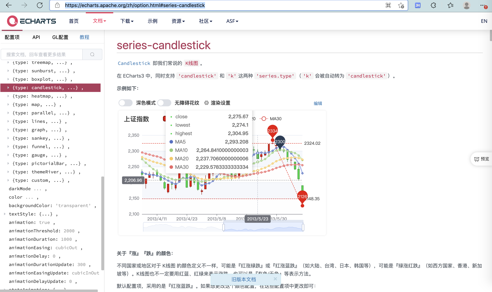
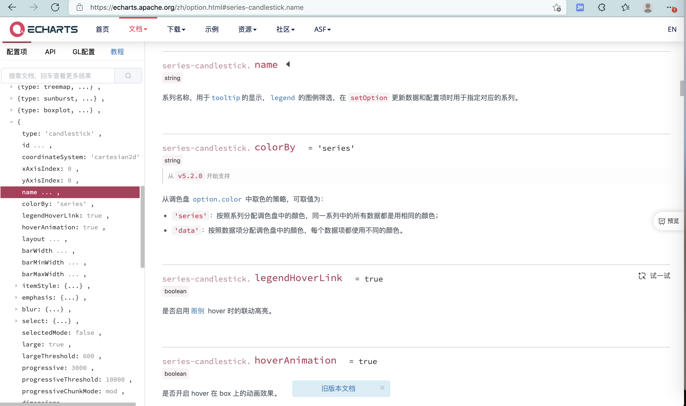
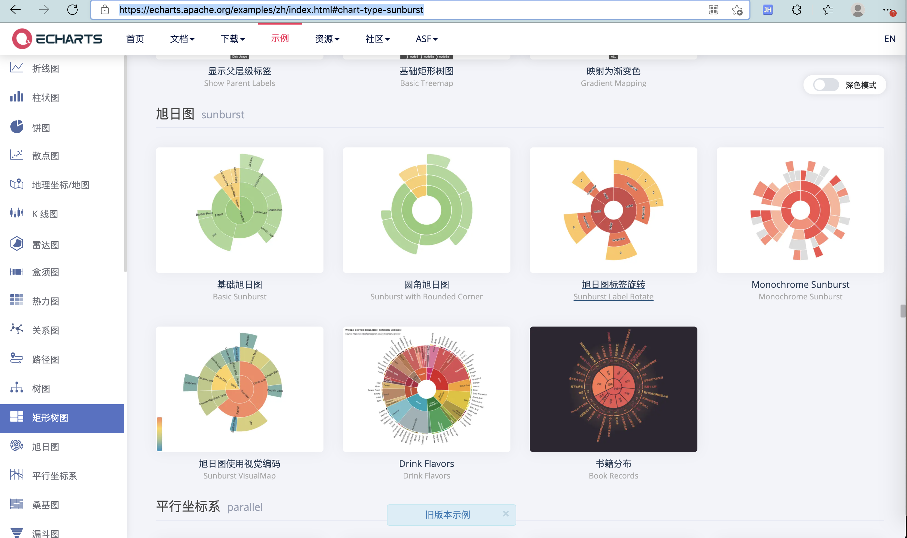
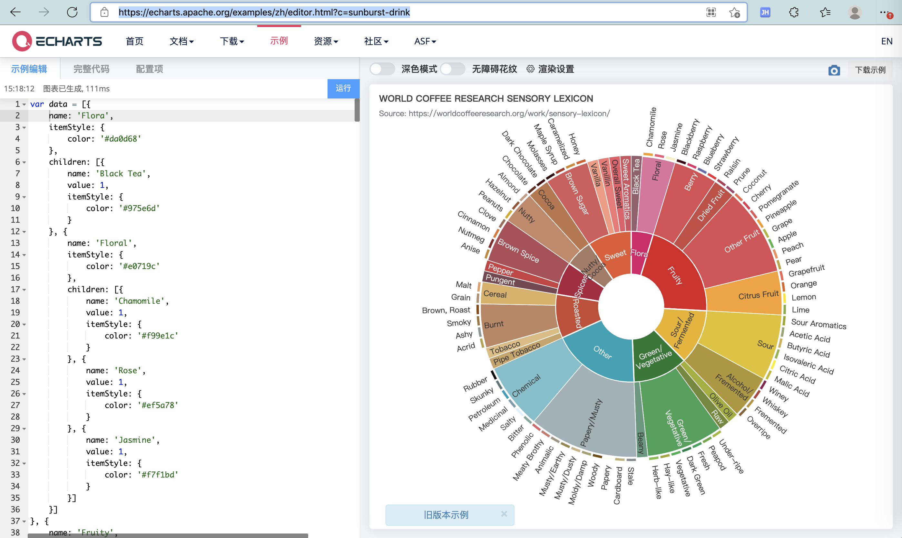
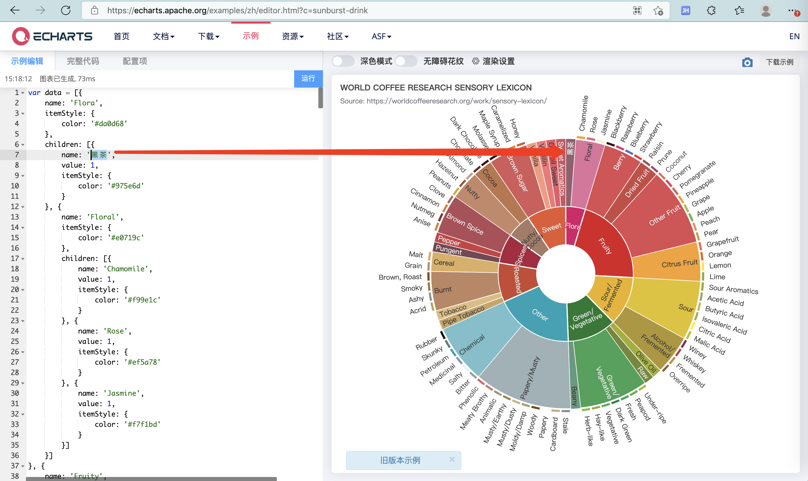

# ECharts使用

## 教程资料

* 最常用的资料
  * 5 分钟上手 ECharts
    * https://echarts.apache.org/zh/tutorial.html#5%20%E5%88%86%E9%92%9F%E4%B8%8A%E6%89%8B%20ECharts
* 如果想要看具体的不同图表的效果，则去
  * 官网的例子
    * ECharts Demo
      * https://echarts.apache.org/examples/zh/index.html
* 网友的例子：叫做GL=Gallery（画廊）=例子的集合
    * Make A Pie
      * https://www.makeapie.com/explore.html
* 如果想要涉及到和图表中的交互，初始化等，则去看：
  * ECharts的API
    * https://echarts.apache.org/zh/api.html#echarts
* 设置option时参考的官网文档
  * ECharts Documentation
    * https://echarts.apache.org/zh/option.html#series-bar.barWidth

## 查看参数配置

* 如果涉及到对于不同的图表类型
  * 想要
    * 知道有哪些参数
    * 不同参数具体如何设置
  * 那么去
    * ECharts的配置项
      * https://echarts.apache.org/zh/option.html
* 比如：
  * 想要查看烛台 candlestick的图的配置参数有哪些时，可以找到对应位置：
    * https://echarts.apache.org/zh/option.html#series-candlestick
      * 
    * 接着就可以一点点找到自己要配置的参数了
      * 

## 编辑源码实时查看效果

不论是`ECharts官网`还是`ECharts Gallery`

进去单个页面后，都可以编辑左边的代码，点击运行，右边可以看到实时的效果：

比如：

https://echarts.apache.org/examples/zh/index.html#chart-type-sunburst

[

点击其中的图表，可以进入具体页面：

https://echarts.apache.org/examples/zh/editor.html?c=sunburst-drink

可以根据需要，去左边直接修改代码，点击运行后，即可在右边看到最新效果：

