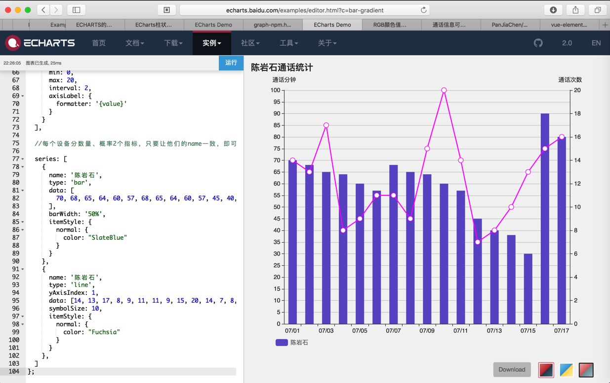

# 柱状图

## 柱状图 带折线 - 通话统计

代码：

```js
option = {
  title: {
    left: 'top',
    text: '陈岩石通话统计',
    show: true
  },
  tooltip: {
    trigger: 'axis',
    formatter: '{a}:{c}',
    axisPointer: {
      type: 'cross',
      crossStyle: {
        color: '#999'
      }
    }
  },
  // grid: {
  //   show: false,
  //   top: '30',
  //   bottom: '60',
  //   right: '60',
  //   left: '60'
  // },
  legend: {
    show: true,
    selectedMode: 'single', //设置显示单一图例的图形，点击可切换
    bottom: 10,
    left: 50,
    textStyle: {
      color: '#666',
      fontSize: 12
    },
    itemGap: 20,
    data: ['陈岩石'],
    inactiveColor: '#ccc'
  },
  xAxis: [
    {
      type: 'category',
      data: [
        '07/01', '07/02', '07/03', '07/04', '07/05', '07/06', '07/07', '07/08', '07/09', '07/10',
        '07/11', '07/12', '07/13', '07/14', '07/15', '07/16', '07/17',
      ],
      axisPointer: {
        type: 'shadow'
      },

      axisTick: {
        show: true,
        interval: 0
      },
    }
  ],

  //设置两个y轴，左边显示数量，右边显示概率

  yAxis: [{
      type: 'value',
      name: '通话分钟',
      show: true,
      interval: 5,
    },
    {
      type: 'value',
      name: '通话次数',
      min: 0,
      max: 20,
      interval: 2,
      axisLabel: {
        formatter: '{value}'
      }
    }
  ],

  //每个设备分数量、概率2个指标，只要让他们的name一致，即可通过，legeng进行统一的切换

  series: [
    {
      name: '陈岩石',
      type: 'bar',
      data: [
        70, 68, 65, 64, 60, 57, 68, 65, 64, 60, 57, 45, 40, 38, 30, 90, 80
      ],
      barWidth: '50%',
      itemStyle: {
        normal: {
          color: "SlateBlue"
        }
      }
    },
    {
      name: '陈岩石',
      type: 'line',
      yAxisIndex: 1,
      data: [14, 13, 17, 8, 9, 11, 11, 9, 15, 20, 14, 7, 8, 10, 13, 15, 16],
      symbolSize: 10,
      itemStyle: {
        normal: {
          color: "Fuchsia"
        }
      }
    },
  ]
};
```

效果：


