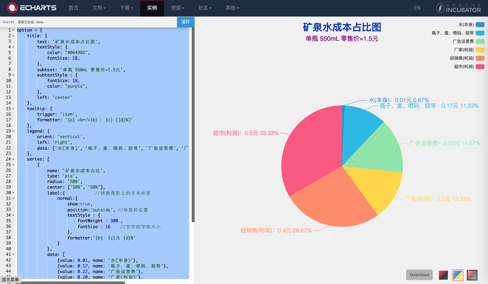
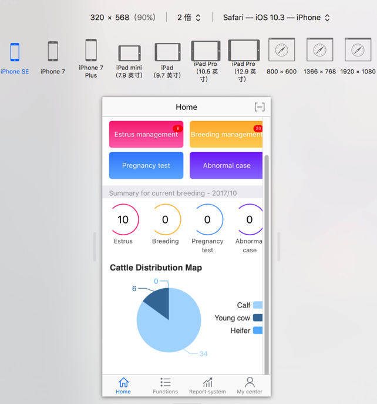
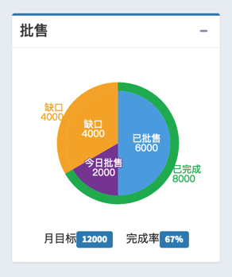

# 饼图

## 矿泉水成本占比

配置代码：

```js
option = {
    title: {
        text: '矿泉水成本占比图',
        textStyle: {
            color: "#0649BD",
            fontSize: 28,
        },
        subtext: '单瓶 550mL 零售价=1.5元',
        subtextStyle : {
            fontSize: 18,
            color: "purple",
        },
        left: 'center'
    },
    tooltip: {
        trigger: 'item',
        formatter: '{a} <br/>{b} : {c} ({d}%)'
    },
    legend: {
        orient: 'vertical',
        left: 'right',
        data: ['水(本身)', '瓶子、盖、喷码、胶带', '广告运营费', '厂家(利润)', '经销商(利润)', '超市(利润)']
    },
    series: [
        {
            name: '矿泉水成本占比',
            type: 'pie',
            radius: '50%',
            center: ['50%', '60%'],
            label:{            //饼图图形上的文本标签
                normal:{
                    show:true,
                    position:'outside', //标签的位置
                    textStyle : {
                        fontWeight : 300 ,
                        fontSize : 16    //文字的字体大小
                    },
                    formatter:'{b}：{c}元 {d}%'
                }
            },
            data: [
                {value: 0.01, name: '水(本身)'},
                {value: 0.17, name: '瓶子、盖、喷码、胶带'},
                {value: 0.22, name: '广告运营费'},
                {value: 0.20, name: '厂家(利润)'},
                {value: 0.40, name: '经销商(利润)'},
                {value: 0.50, name: '超市(利润)'}
            ],
            emphasis: {
                itemStyle: {
                    shadowBlur: 10,
                    shadowOffsetX: 0,
                    shadowColor: 'rgba(0, 0, 0, 0.5)'
                }
            }
        }
    ]
};
```

效果：



## 饼图向左移动

代码：

```js
    series: [{
      type: 'pie',
      center: ["40%", "55%"],
      ...
```

效果：



## 外层圆环内层扇区的饼图

代码：

```js
        <div class="col-md-">
          <div class="box box-primary">
            <div class="box-header with-border">
              <h3 class="box-title">批售</h3>
    
              <div class="box-tools pull-right">
                <button type="button" class="btn btn-box-tool" data-widget="collapse" data-toggle="tooltip" title="Collapse">
                <i class="fa fa-minus"></i></button>
              </div>
            </div>
            <div class="box-body">
              <div id="echart_wholesales" style="height:220px;" ></div>
              <div style="text-align:center;">
                  <p>
                    月目标<span class="label label-primary">12000</span>
                    &nbsp;&nbsp;&nbsp;&nbsp;
                    完成率<span class="label label-primary">67%</span>
                  </p>
              </div>
            </div>
          </div>
        </div>

<script type="text/javascript">
  var wholesalesEcharts = echarts.init(document.getElementById('echart_wholesales'));
  option = {
    title: {
        text: "",
        subtext: "",
        left: "center",
        textStyle: {
            color: "#fff",
            fontSize: 18
        },
    },
    backgroundColor: '#ffffff',
    tooltip: {
        trigger: 'item',
        formatter: "{a} <br/>{b}:({d}%)"
    },
    series: [{
        name: '批售详细数据',
        type: 'pie',
        radius: ['0%', '60%'],
        // color: ['#ec5d51', '#59abe1', '#f4cf42', '#3dc6a8'],
        color: ['#5DADE2', '#884EA0', '#F5B041', ],
        // color: ['#FDFEFE', '#28B463'],
        // color: ['#a0dca0', '#60bbb6', '#f78db3'],
        label: {
            normal: {
                position: 'inner',
                formatter: '{b}\n{c}'
            }
        },
        data: [
          {
              value: 6000,
              name: '已批售'
          },
          {
              value: 2000,
              name: '今日批售'
          },
          {
              value: 4000,
              name: '缺口'
          },
        ]
    }, {
        name: '批售总体数据',
        type: 'pie',
        radius: ['60%', '70%'],
        labelLine : {
          normal : {
            length : 1,
            length2 : 1
          }
        },
        //color: ['#a0dca0', '#60bbb6', '#f78db3', '#feadac', '#fae395′,'#91d4e5′,'#8eb3e8'],
        color: ['#28B463', '#FDFEFE'],
        label: {
            normal: {
               formatter: '{b}\n{c}'
            }
        },
        data: [
          {
              value: 8000,
              name: '已完成'
          },
          {
              value: 4000,
              name: '缺口'
          }
        ]
    }]
};
wholesalesEcharts.setOption(option);
</script>
```

效果：


