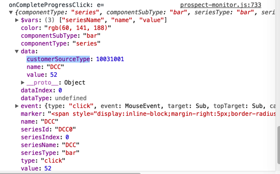
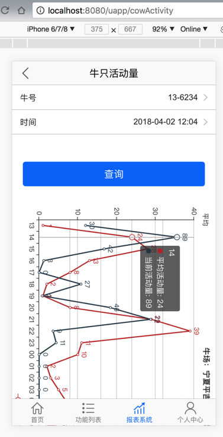
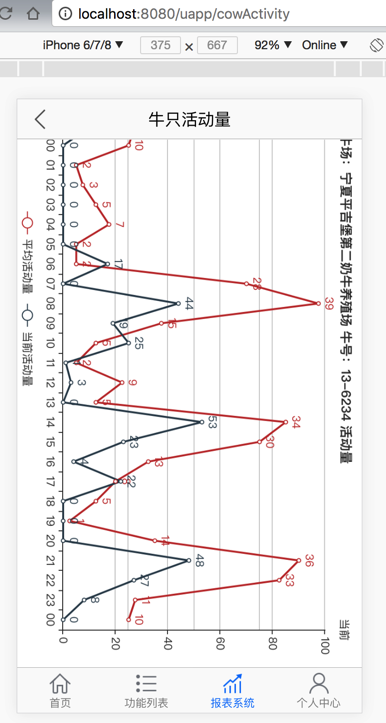

# ECharts心得

## 点击时获得额外自定义数据

此处设置series中的data（列表）中的每个对象，系统是直接赋值给内部属性的，比如常见的：

`name`和`value`

对应着官网的API中的参数：

https://echarts.apache.org/zh/option.html#series-bar.data.name

但是除此之外的其他自己定义的属性名，比如下面再去试试customerSourceType，ECharts可以自动忽略，重点的是：不会报错。

且还可以：

在点击事件回调函数中，可以返回对应的原先的dict值。

比如再去试试：

```js
    data: [
        {
            name: CUSTOMER_SOURCE.DCC.name,
            value: dccNum,
            customerSourceType: CUSTOMER_SOURCE.DCC.type,
        }
    ]
```

效果：



## 竖向图表

```js
const cowActivityStyle = {
  // width: '90vw',
  // height: '150vh',
  // margin: '75vw auto'
  // width: '375px',
  // height: '600px',
  // margin: 'auto',
  // width: '1700px', // HH:mm
  width: '900px', // HH
  // height: '300px',
  // height: '375px'
  height: '100vw'
  // margin: '0'
  // overflow: "scroll"
};


function getOtion(data, cowFarm, cowCode) {
  console.log(`getOtion data=${data}`);
  let yAxisAverageActivityDataList = [];
  let yAxisCurrentActivityDataList = [];
  let xAxisDatetimeDataList = [];

  for (let eachDict of data) {
    yAxisAverageActivityDataList.push(eachDict.Int_AvgSteps);
    yAxisCurrentActivityDataList.push(eachDict.Int_Steps);
    let dtmDatetime = timestampToDate(eachDict.Dtm_Date);
    // console.log(`dtmDatetime=${dtmDatetime}`);
    // let formatedDatetime = datetimeToStr(dtmDatetime, "", "HH:mm");
    let formatedDatetime = datetimeToStr(dtmDatetime, "", "HH");
    // console.log(`formatedDatetime=${formatedDatetime}`);
    xAxisDatetimeDataList.push(formatedDatetime);
  }

  console.log(`yAxisAverageActivityDataList=${yAxisAverageActivityDataList}`);
  console.log(`yAxisCurrentActivityDataList=${yAxisCurrentActivityDataList}`);
  console.log(`xAxisDatetimeDataList=${xAxisDatetimeDataList}`);

  return {
    title: {
      show: true,
      text: `牛场：${cowFarm} 牛号：${cowCode} 活动量`,
      left: "center",
      top: 5,
      textStyle: {
        fontSize: 14,
        align: "center",
        verticalAlign: "bottom"
      }
    },
    tooltip : {
      trigger: 'axis'
    },
    legend: {
      data: ['平均活动量','当前活动量'],
      top: "bottom",
      left: "center"
    },
    grid: {
      show: false,
      left: "4%",
      right: "10%",
      top: "40",
      bottom: "50"
    },
    xAxis : [
      {
        type : 'category',
        data : xAxisDatetimeDataList
      }
    ],
    yAxis : [
      {
        type : 'value',
        name : '平均',
        axisLabel : {
          formatter: '{value}'
        }
      },
      {
        type : 'value',
        name : '当前',
        axisLabel : {
          formatter: '{value}'
        }
      }
    ],
    series: [
      {
        name: "平均活动量",
        type: "line",
        label: {
          normal: {
            show: true
          }
        },
        yAxisIndex: 0,
        data: yAxisAverageActivityDataList
      },
      {
        name: "当前活动量",
        type: "line",
        yAxisIndex: 1,
        label: {
          normal: {
            show: true
          }
        },
        data: yAxisCurrentActivityDataList
      }
    ]
  };
}


        <div class={style.activity_chart}>
          {/* <div class={style.activity_title}>
            <p>牛场:&amp;nbsp;xxxx&amp;nbsp;&amp;nbsp;牛号:&amp;nbsp;12345</p>
          </div> */}

          <ReactEcharts
            style={cowActivityStyle}
            option={getOtion(this.state.respCowActivityData, "宁夏平吉堡第二奶牛养殖场", this.state.cow_code)}
          />
        </div>
```

以及css：

```css
.activity_chart {
  transform: rotate(90deg);
}
```

效果：




